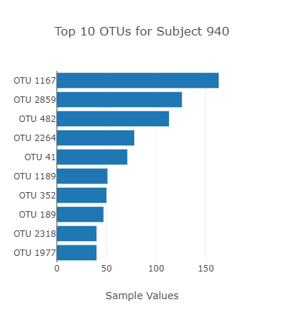
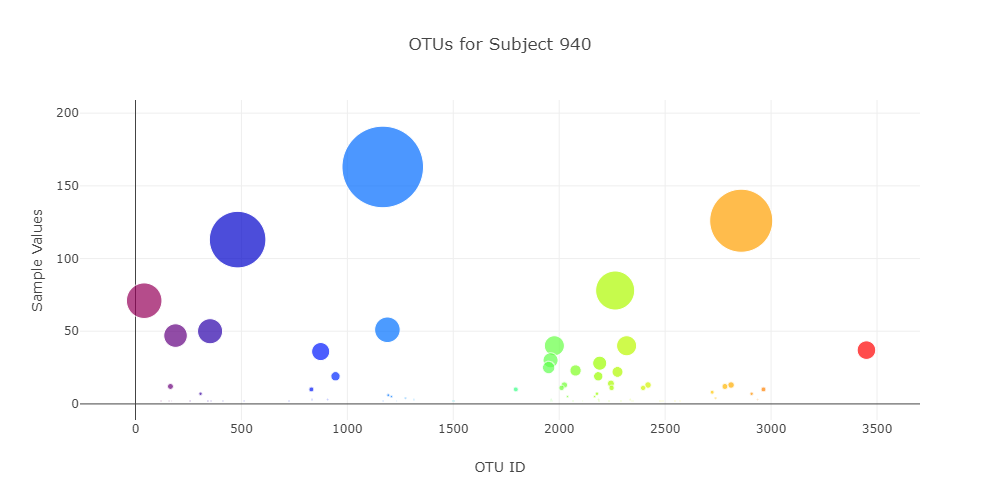

# belly-button-challenge

#Instructions
Complete the following steps:

**1-Use the D3 library to read in samples.json from the URL https://2u-data-curriculum-team.s3.amazonaws.com/dataviz-classroom/v1.1/14-Interactive-Web-Visualizations/02-Homework/samples.json.

Create a horizontal bar chart with a dropdown menu to display the top 10 OTUs found in that individual.

Use sample_values as the values for the bar chart.

Use otu_ids as the labels for the bar chart.

Use otu_labels as the hovertext for the chart.

**2-Create a bubble chart that displays each sample.

Use otu_ids for the x values.

Use sample_values for the y values.

Use sample_values for the marker size.

Use otu_ids for the marker colors.

Use otu_labels for the text values.

